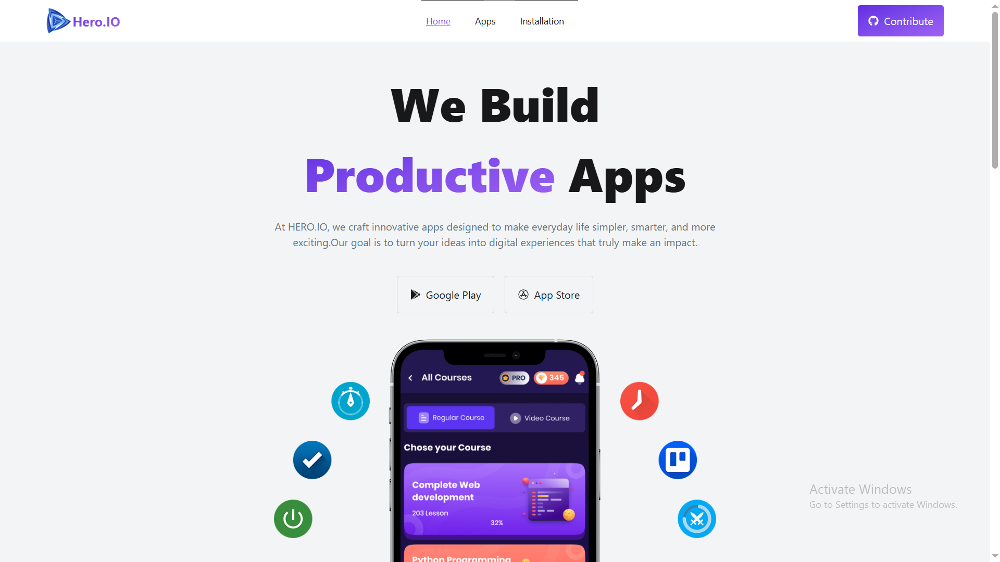
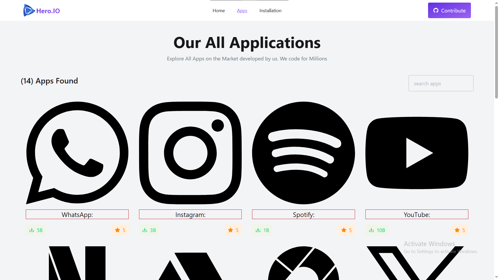
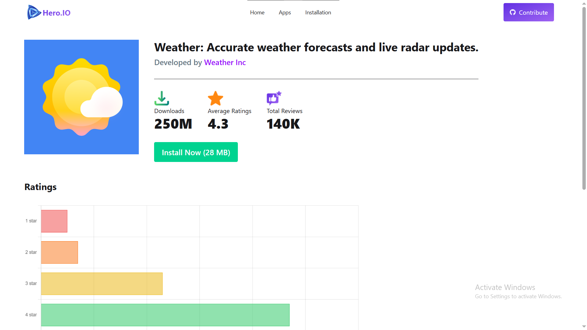
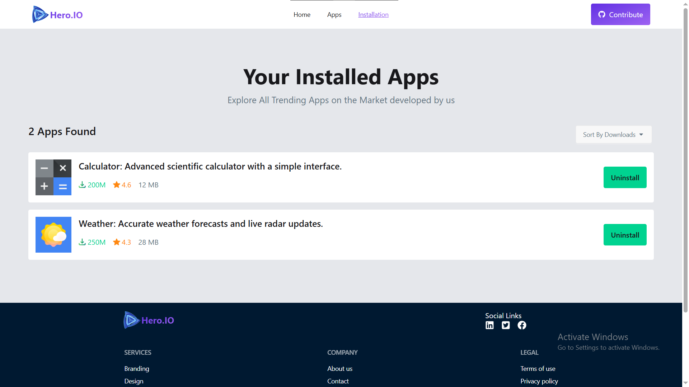
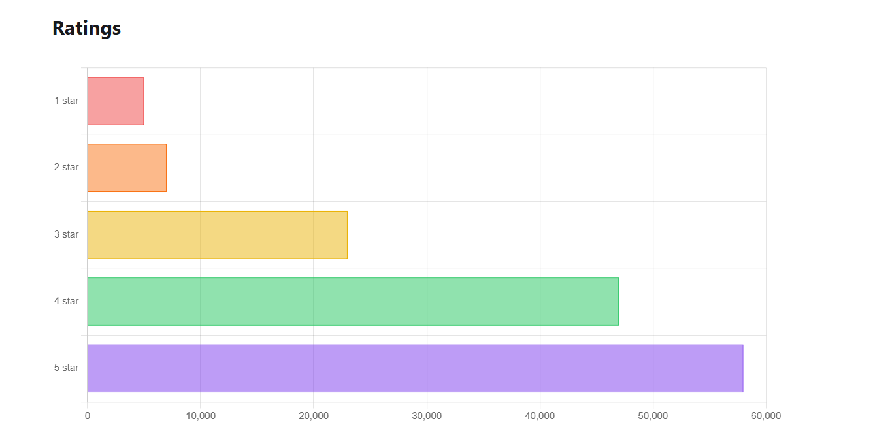

# Hero.IO

## 📌 Overview

**Hero.IO** is a modern web application that showcases trending apps, allows users to explore detailed app information, and manage installed apps using browser local storage.

The project focuses on building a clean, responsive, and user-friendly interface while applying modern frontend development practices using React and related technologies.

---

## Features

- Browse all available apps
- View detailed information for each app
- Install apps (stored in localStorage)
- Uninstall apps dynamically
- View app statistics (downloads, ratings, reviews)
- Sort installed apps by downloads (High → Low / Low → High)
- Fully responsive UI

---

## 🛠️ Technologies Used

### Frontend

- **React.js** – Component-based UI development
- **React Router** – Routing and navigation
- **Tailwind CSS** – Utility-first styling
- **DaisyUI** – Prebuilt UI components

### State & Data Handling

- **React Hooks** (`useState`, `useEffect`)
- **Local Storage API** – Persistent client-side data

### Visualization

- **Chart.js**
- **React-Chartjs-2**

---

## 📂 Project Structure (Simplified)

```
src/
│
├── Components/
│   ├── Hero/
│   ├── AllApps/
│   ├── AppDetails/
│   ├── InstalledApp/
│   ├── Navbar/
│   └── Root/
│
├── utilities/
│   └── installToLocal.js
│
├── assets/
└── main.jsx
```

---

## Future Improvements

- Global state management (Context API / Redux)
- Data caching & performance optimization
- Advanced filtering system
- Modal-based app details view
- Backend integration (MERN stack)

---

## 📸 Screenshots

| Home                        | All Apps                        |
| --------------------------- | ------------------------------- |
|  |  |

| Details                        | Installed                        |
| ------------------------------ | -------------------------------- |
|  |  |

### Statistics



---

## Final Note

This project is part of a continuous learning journey toward becoming a professional frontend developer. The focus is not just on building features, but on writing **clean, scalable, and maintainable code**.

---
